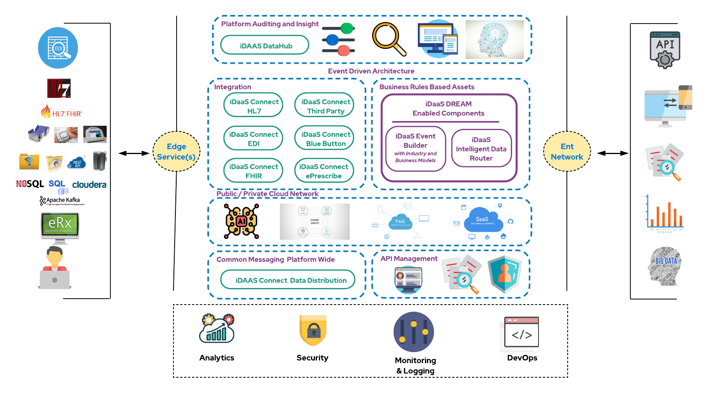

# Background
This is the upstream community to to Red Hat Healthcare's Intelligent DaaS. Please feel free to go to our discussion
and/or issues areas. Any feedback is considered as we always look to improve our design pattern/reference architecture. 
Any communication to these areas or the project owners influences our [Technical Roadmap](docs/Roadmap/index.md).

# Common Links
Below are common links to help you navigate all the site content. 

| General|Platform Design |
| -------------|----------|
|[General Background](./docs/General/Background.md)|[Architecture](docs/Design/Architecture.md)|
|[OpenSource](docs/General/OpenSource.md)|[Design Principles](docs/Design/DesignPrinciples.md)|
|[Code of Conduct](docs/General/CodeOfConduct.md)|[Capabilities](docs/Design/Capabilities.md)|
|[Fictious Org.](docs/General/FictitiousOrg.md)|[Platform Components](docs/Design/PlatformComponents.md)|
|[Technical Leadership](docs/General/TechnicalLeadership.md)|[Integration Standards Support](docs/Design/IntegrationStandardsSupported.md)|

More specific links around technologies used, setup and implementations:

| Technical |Use Cases - Implementations |
| -------------|----------|
|[Technologies Leveraged](docs/Technical/Technologies.md)|[Platform Component Specifics](docs/UseCases/PlatformComponents-Specific.md)|
|[Technical Guides](docs/Technical/intro.md)|[Implementation Guides](docs/ImplementationGuides/intro.md)|

# Intelligent DaaS (Data as a Service)
Welcome, Intelligent DaaS (Data as a Service) is a newer form of innovation. It is intended to be a <b> design pattern/reference architecture/accelerator </b> 
built atop industry leading software. The sole purpose of ALL the capabilities we have enabled for healthcare is enable <b> Data as an Asset</b>. 
Data Integration is all about Data Innovation and all the things that can be done without data:

Here is another way to think about data innovation with intelligent Daas.

With all this being said, <b>it was important for our code to be completely open and available with Apache 2 License!!</b>
We are sure you have doubts and questions like:

* I already have an integration engine or enterprise application integration platform? You should not replace an existing 
  integration engine or EAI platform, that would take time with lots of coordination. We would argue it is working for the 
  masses then you should keep it in place. Do you view that platform as strategic or innovative though? Probably not, but 
  it can provide access to existing information for business efforts though. Why not use it for what is good at and build 
  innovation atop it. You can also enable innovation at an enterprise, organization or team level with this model without 
  sacrificing security.
* I have heard all of this before and I am still not seeing any industry progress? The industry is evolving and changing. 
  Digital in healthcare, along with several other factors, is causing the entire way healthcare data to not only be 
  re-imagined but re-evaluated. This is forcing various changes including
  new and more modern integration standards.
* Why would you do this? Its time to help lead and drive change.

Has anyone run the risk and put their code and all their work out there for the masses to leverage in this manner? The upstream open source projects our core to our culture is all about open source and an open-source mindset. Because of this we decided to follow those practices for everything for this effort. We also have and will continue to publish onto Git Hub through our organization.
# Partnering to Delivery Industry Enablement
Partnering is at the core of our capabilities we are enabling for the healthcare industries.

[Driving Innovation](docs/Technical/Implementation.md)

 
Happy coding!!!!
